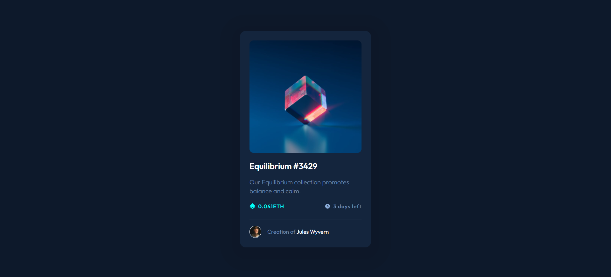

# Frontend Mentor - NFT preview card component solution

This is a solution to the [NFT preview card component challenge on Frontend Mentor](https://www.frontendmentor.io/challenges/nft-preview-card-component-SbdUL_w0U). Frontend Mentor challenges help you improve your coding skills by building realistic projects.

## Table of contents

- [Overview](#overview)
  - [Screenshot](#screenshot)
  - [Links](#links)
- [My process](#my-process)
  - [Built with](#built-with)
  - [What I learned](#what-i-learned)
  - [Continued development](#continued-development)
  - [Useful resources](#useful-resources)
- [Author](#author)

## Overview

### Screenshot

### Links

- Solution URL: [Add solution URL here](https://github.com/alyssasitto/card-component-project)
- Live Site URL: [Add live site URL here](https://equilibrium-component-80cffd.netlify.app/)

## My process

I did a mobile first approach and started with the html and added classes to all elements that I planned to style. I then worked on the css and styled from top to bottom.

### Built with

- Semantic HTML5 markup
- CSS custom properties
- Flexbox
- Mobile-first workflow

### What I learned

I learned how to add a color to an image when hovering which is something I did not know how to do before without a background-image

### Continued development

I want to continue learning how to use absolute and relative positioning

### Useful resources

- [Example resource 1](https://youtu.be/-wV4Har4xkQ) - This video helped me learn how to overlay an image with a color.

## Author

- Website - [Alyssa Sitto](https://equilibrium-component-80cffd.netlify.app/)
- Frontend Mentor - [@alyssasitto](https://www.frontendmentor.io/profile/alyssasitto)
